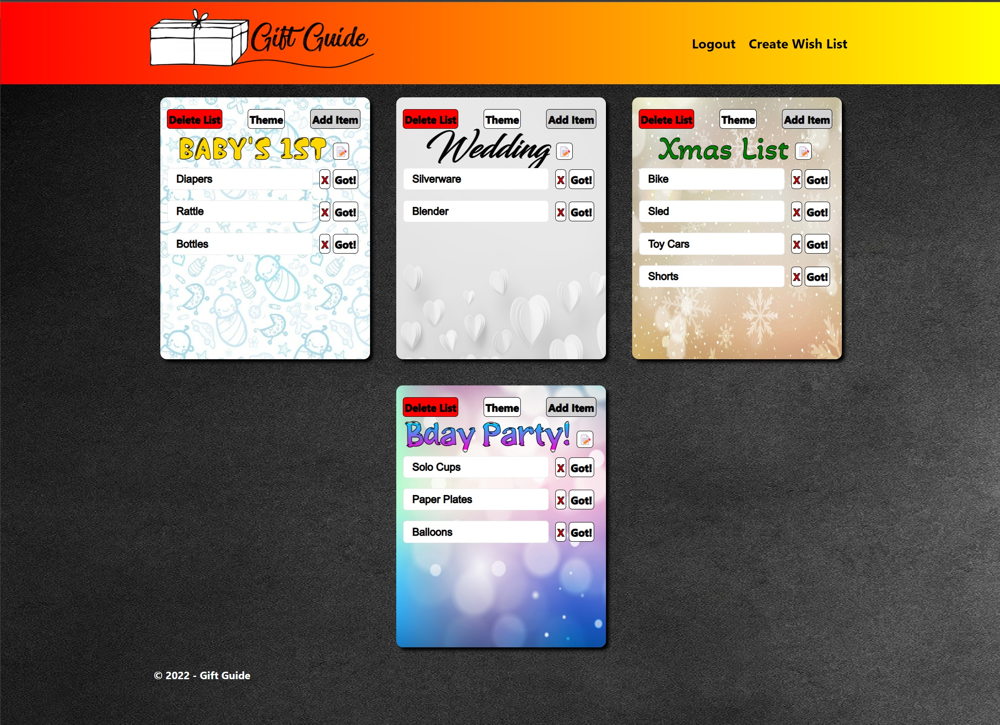

# Gift Guide

## Description

Gift Guide is an app that allows you to create a wishlist of gifts you'd like to receive from loved ones. You can create multiple wishlists and even invite friends to assigns themselves a gift to give to you while still keeping the gifts a surprise for the wishlist owner. The app makes it easy to keep track of the gifts you're hoping to receive and ensures that you get exactly what you want. The functionality of our app allows you to also changes themes of your wishlist catered towards the special event. Our goal was to make gift sharing less awkward all in one fun and user friendly app.

## Table of Contents

- [Installation](#installation)
- [Usage](#usage)
- [License](#license)
- [Contribute](#contribute)
- [Tests](#tests)
- [Technology Used](#technology-used)
- [Questions](#questions)

## Installation

To install this application, clone the code into your terminal for the respective repository. Then, install express package by entering the command npm i into the terminal and run: npm run develop.

## Usage

Install npm and dependencies: npm i.
Run npm run develop on your terminal (command line).

If you would like to use the app you would need to sign up. Once logged in you can click on Create Wishlist and invite friends to choose their gifts from the wishlist created.

 

## License

This application uses the MIT License.

Copyright (c) 2022 Kevin Chen, Malvina Hasa, Jackson Impellizeri, Hasan Noor, Roody Senecal, Alice Shao, Sindid

Permission is hereby granted, free of charge, to any person obtaining a copy
of this software and associated documentation files (the "Software"), to deal
in the Software without restriction, including without limitation the rights
to use, copy, modify, merge, publish, distribute, sublicense, and/or sell
copies of the Software, and to permit persons to whom the Software is
furnished to do so, subject to the following conditions:

The above copyright notice and this permission notice shall be included in all
copies or substantial portions of the Software.

THE SOFTWARE IS PROVIDED "AS IS", WITHOUT WARRANTY OF ANY KIND, EXPRESS OR
IMPLIED, INCLUDING BUT NOT LIMITED TO THE WARRANTIES OF MERCHANTABILITY,
FITNESS FOR A PARTICULAR PURPOSE AND NONINFRINGEMENT. IN NO EVENT SHALL THE
AUTHORS OR COPYRIGHT HOLDERS BE LIABLE FOR ANY CLAIM, DAMAGES OR OTHER
LIABILITY, WHETHER IN AN ACTION OF CONTRACT, TORT OR OTHERWISE, ARISING FROM,
OUT OF OR IN CONNECTION WITH THE SOFTWARE OR THE USE OR OTHER DEALINGS IN THE
SOFTWARE.

## Contribute

To contribute to social-network, clone this repo locally and commit your code on a separate branch. You can also fork the repo and make your pull requests with suggested improvements.

## Tests

To test the app visit: https://jaxpi.github.io/DEPLOYEDLINK/

It can also be tested by entering at command prompt:

npm install (ensure all that dependencies are installed)

npm init

npm run develop ( cd to the correct directory)

## Technologies Used

This application is a MERN stack app using:

MongoDb - Database (model) - Stores raw data and contains no logic.
* [![MongoDB][Mongodb]][Mongodb -url]

Express.js and Node.js - Server (controller) - Method called to store and retrieve data in database.
*  [![NodeJS][Node.js]][Nodejs-url]

React JS - Client (View) - User inputs data and Data display
* [![ReactJS][React.js]][Reactjs-url]

This application is fully functioning as a Graph API built with Apollo Server.

[Nodejs-url]: https://nodejs.org/en/ 
[Node.js]: https://img.shields.io/badge/NodeJS-NodeJS-green
[Mongodb-url]: https://www.mongodb.com/
[Mongodb]: (https://img.shields.io/badge/MongoDB-%234ea94b.svg?style=for-the-badge&logo=mongodb&logoColor=white)
[Reactjs-url]: https://reactjs.org/
[React.js]: (https://img.shields.io/badge/-ReactJs-61DAFB?logo=react&logoColor=white&style=for-the-badge)